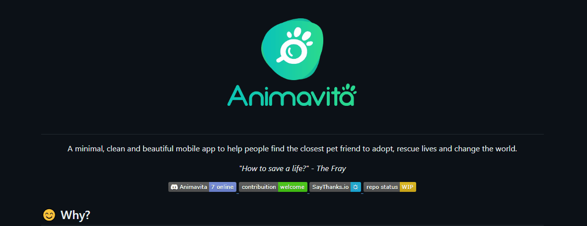

# Projeto com README
UM projeto de teste com um arquivo README 🐱‍👤


[](https://google.com)

## Tecnologias utilizadass
- HTML
- CSS
- JS

## Como usar

1 - clone o prejeto
```
git clone <url>
```
2 - Acesse a pasta do projeto
```
cd repositorio-com-readme
```
